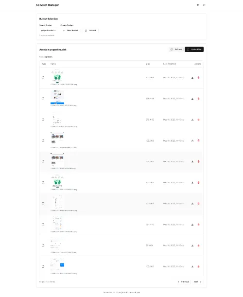

# 📁 S3 Asset Manager

A secure, browser-based file manager for S3-compatible object storage (e.g., AWS S3, NEO Object Storage, MinIO, DigitalOcean Spaces).

[Preview S3 Asset Manager](https://s3.yanginibeda.com/)

## ✨ Features

- ✅ Connect to any S3-compatible endpoin t (AWS, NEO, MinIO, etc.)
- 🗂️ Browse buckets & folders (prefix-based navigation)
- 🖼️ Preview images via **pre-signed URLs** (secure, no public bucket required)
- 📤 Upload single or multiple files (multipart form data)
- 🗑️ Delete objects
- 🔐 Credentials never exposed client-side — all sensitive operations handled server-side
- 🌐 Responsive UI with React + Next.js App Router

---

## ⚙️ Configuration

### 1. S3 Connection Setup
Enter your credentials in the **S3 Configuration** modal:

| Field             | Example Value                          | Notes |
|-------------------|----------------------------------------|-------|
| **Endpoint URL**  | `https://aws.com`             | For NEO Object Storage |
| **Region**        | `us-east-1`                                  | Region code (e.g., `us-east-1`, `ap-southeast-1`) |
| **Access Key ID** | `XXXXX`                | Never commit this! |
| **Secret Access Key** | `XXXXX` | Masked in UI; |

> 🔒 **Security**: Keys are passed via API routes (`/api/s3/*`) — **never stored in frontend code or Git**.

### 2. Bucket Selection
After connecting:
- Select an existing bucket (e.g., `Folder1`.`folder2` etc...)
- Or create a new one via **+ New Bucket**
- Click **Refresh** to reload bucket list

![Bucket Selection UI]

## 🏷️ Rebranding Checklist

When changing the brand name, update these files:

### Brand Name / Title
| File | Line | Current Value |
|------|------|---------------|
| `app/layout.tsx` | 11 | `title: 'S3 Asset Manager'` |
| `app/layout.tsx` | 12 | `description: 'Manage your S3 assets...'` |
| `app/layout.tsx` | 13 | `generator: 'oktaviardi.com'` |
| `app/layout.tsx` | 15-30 | Icon paths (`/icon-light-32x32.png`, etc.) |
| `app/page.tsx` | 5 | Comment line `S3 Asset Manager application` |
| `components/s3-manager.tsx` | 607 | `<h1>S3 Asset Manager</h1>` |
| `package.json` | 2 | `"name": "oktaviardi.com-project"` |
| `README.md` | 1 | Heading `S3 Asset Manager` |
| `README.md` | 6 | Preview URL `s3.yanginibeda.com` |

### Brand-specific URLs & Endpoints
| File | Line | Value |
|------|------|-------|
| `components/s3-manager.tsx` | 188 | Public URL base `https://nos.jkt-1.neo.id/` |

### Google Analytics
No Google Analytics code detected in the codebase. If you need to add it, insert the gtag snippet in `app/layout.tsx`.

### Search Console
No Search Console verification tag detected. If needed, add `<meta name="google-site-verification" content="...">` in the `<head>` of `app/layout.tsx`.

### Google Sheets / AppScript
No Google Sheets IDs or AppScript references detected in the codebase.

---

## 🚀 Branching Rule

### 1. Branch Naming
Format: <tipe>/<deskripsi>
- feature/: Fitur baru
- bugfix/: Perbaikan bug biasa
- hotfix/: Perbaikan urgent produksi
- chore/: Maintenance/config
- docs/: Dokumentasi
- refactor/: Refactoring kode

### 2. Commit Message
Format: <type>(<scope>): <subject>
  - Type: `feat, fix, chore, docs, style, refactor, test, perf`.
  - Scope (Opsional): Bagian kode (api, ui, db).
  - Subject: Ringkas, imperatif, huruf kecil, max 50 karakter, tanpa titik.
  - Body/Footer (Opsional): Penjelasan detail & referensi issue (Closes #123).

### 3. Tagging (SemVer)
Format: v<major>.<minor>.<patch>
- MAJOR: Perubahan tidak kompatibel (breaking changes).
- MINOR: Fitur baru (kompatibel).
- PATCH: Bug fix (kompatibel).
- Aturan: Hanya tag di branch main setelah PR di-merge & build sukses.
